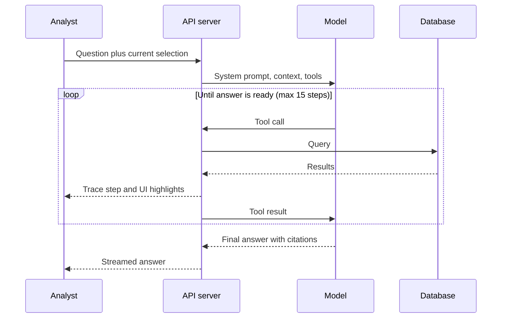
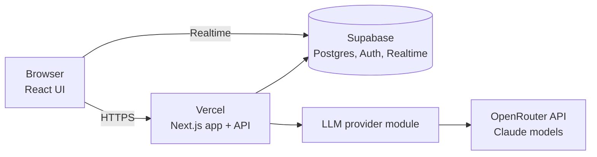

# Fusion Cell — Product Requirements Document

2026-09-16 · @u_6Zc8GRicjOauvzYHNewqMA

## 1. Overview

Fusion Cell is a web-based all-source intelligence workspace that combines a geospatial operating picture, an interactive link chart, and an AI analyst that reasons over both. It is built for a 1–3 day internal hackathon, but it must be a real, working application with a database, an API, and live AI features, so it can grow into an operational prototype later.

**Problem.** Analysts spend most of their time finding, reading, and connecting reports scattered across systems. Relationships between people, organizations, places, and events live in their heads or in static slides. Producing a finished assessment takes hours.

**Vision.** One screen where an analyst sees what is happening (map), who is connected to whom (link chart), what just came in (live feed), and can ask an AI analyst to investigate, explain, and draft a brief, with every claim traceable to a source report.

**Hackathon context.** The team is six non-developers building with Claude Code. The app uses an original fictional sci-fi universe as seed data, which makes the demo memorable and makes it obvious that no real data is involved. The architecture treats the fictional data as ordinary data, so a real dataset could replace it without code changes.

## 2. Goals, non-goals, and success criteria

**Goals**

- Deliver a working, persistent application: real database, real API, real AI calls. No hard-coded mock screens.
- Make the map and link chart two synchronized views of the same underlying data.
- Make the AI analyst a first-class feature that uses tools to query the data, highlight results in the UI, and cite sources.
- Let users ingest new raw reports and have AI extract entities and relationships for human review.
- Look and feel like a polished mission system: dark theme, motion, live updates.
- Keep the codebase clean and modular enough to extend after the hackathon.

**Non-goals (for the hackathon)**

- Handling real classified, CUI, or operational data.
- Accreditation, ATO, or production security hardening (designed for, not implemented).
- Integration with real government systems or data feeds.
- Mobile layouts. Target is a desktop browser at 1920×1080 and 1440×900.
- Multi-tenant or large-scale performance tuning.

**Success criteria**

| Criterion | Target |
| --- | --- |
| Demo runs end to end without restarts | 3 consecutive rehearsals |
| AI analyst answers the scripted mystery question correctly with citations | Yes, live |
| Ingest a new pasted report and see it appear on map and graph | Under 30 seconds |
| Map and link chart stay in sync on selection and filters | Every selection |
| App is live at a Vercel URL and redeploys automatically on push | No manual steps after initial account setup |
| Judges' impression | "This looks like a real product" |

## 3. Users and user stories

| Persona | Role | Primary need |
| --- | --- | --- |
| All-source analyst | Builds assessments from many report types | Find connections fast and cite sources |
| Watch officer | Monitors activity in real time | See new events and alerts as they arrive |
| Collection manager | Decides where to focus collection | See gaps, low-confidence areas, and stale entities |
| Commander / decision-maker | Consumes finished products | A short, trustworthy brief with a bottom line up front |
| Admin | Manages data and users | Import data, manage users, view the audit log |

**Core user stories (must-have)**

1. As an analyst, I can see all located events on a map and filter by time, faction, event type, and confidence.
2. As an analyst, I can open a link chart of entities and relationships, expand a node's neighbors, and find the shortest path between two entities.
3. As an analyst, when I select something on the map, the related entities highlight on the link chart, and the reverse.
4. As an analyst, I can open an entity profile showing attributes, timeline, connections, and source reports.
5. As an analyst, I can ask the AI analyst a question in plain English and get a streamed answer with citations to specific reports, and the relevant items highlight in the map and graph.
6. As an analyst, I can paste a raw report, have AI extract entities, relationships, locations, and times, review and edit the extractions, then commit them to the database.
7. As a decision-maker, I can generate a formatted intelligence brief on a topic or region and export it.
8. As a watch officer, I see new reports arrive in a live feed and get alerts when watchlist entities appear.

**Should-have**

- Timeline scrubber that animates map activity over the 30-day scenario.
- Saved investigations (a named workspace of pinned entities, notes, and AI conversation).
- Analyst annotations and manual relationship creation.
- Global search with keyword and semantic modes.

**Could-have**

- "Scenario replay" mode that drip-feeds reports to simulate a live watch floor.
- AI anomaly scan that proactively flags suspicious patterns.
- Collaboration presence (see which teammate is viewing which entity).

## 4. Seed universe and dataset

The seed data is an original fictional setting called **the Meridian Reach**, a frontier star cluster. It uses no characters, names, or imagery from existing franchises. The team may rename anything; the structure matters more than the names.

**Factions**

| Faction | Role in scenario | Color on UI |
| --- | --- | --- |
| Concord Alliance | The "home" side the analysts work for | Cyan |
| Vantor Hegemony | Primary adversary, expanding toward the Reach | Crimson |
| Ashen Cartel | Smuggling and arms network that sells to anyone | Amber |
| Free Port of Kestrel | Neutral trade hub, heavy traffic, weak oversight | Violet |
| Unaffiliated | Merchants, pilgrims, salvagers | Gray |

**Geography.** Around 40 locations: star systems, stations, jump gates, moons, and shipping lanes. Store them with longitude/latitude-style coordinates inside a fixed bounding box (for example, lon −30 to 30, lat −20 to 20). The map renders them on a custom starfield basemap, but because the coordinates are standard, a real geographic basemap can replace it later.

**Hidden storyline (the demo mystery).** A Concord logistics officer, Lt. Cmdr. Ilsa Varro, is leaking convoy schedules. She passes them through a shell shipping company, Brightwater Hauling, on Kestrel. The Ashen Cartel buys the schedules and resells them to the Hegemony, which is staging raiders for an ambush on Concord Convoy 7 at the Tessaly Gate on scenario day 31.

No single report reveals this. The clues are spread across report types:

- A signals intercept mentions a source codenamed LANTERN with "access to movement tables."
- Financial reports show recurring payments from a Cartel front to Brightwater Hauling, then to an account linked to Varro's family.
- Ship tracking shows a Brightwater freighter with transponder gaps near Hegemony space, each two days after a Concord schedule update.
- A human-source report from Kestrel describes a Concord officer meeting a Brightwater manager.
- Imagery reports show Hegemony raider hulls gathering near the Tessaly Gate over the final week.
- Several red herrings point to a different officer and a legitimate trader, so the AI must weigh evidence rather than keyword-match.

The demo question is: "Who is LANTERN, and what are they enabling?" The correct answer names Varro, traces the path Varro → Brightwater → Ashen Cartel → Hegemony, and warns about the Tessaly Gate ambush with a stated confidence level.

**Dataset size and shape**

| Object | Approx. count | Notes |
| --- | --- | --- |
| Entities | 150 | People, organizations, vessels, locations, accounts, equipment |
| Relationships | 400 | Typed, dated, with confidence and source reports |
| Reports | 300 | Across a 30-day window, 80–400 words each |
| Events | 250 | Located and timed, derived from reports |
| Watchlist entries | 10 | Some trigger alerts during scenario replay |
| Users | 6 | One per team member, plus a demo account |

**Report types and styles.** SIGINT-style intercept summaries, HUMINT-style source reports, IMINT-style imagery observations, OSINT-style news items from in-universe media, financial transaction records, and ship-tracking logs. Each has a realistic format (header, date-time group, source reliability, body). Every report carries the marking `EXERCISE – FICTIONAL DATA`.

**Generation approach.** Claude Code writes a seed-generation script that produces JSON files from a hand-written "story bible" file. The story bible defines factions, key characters, the timeline of true events, and the clue plan. The script then generates background noise reports around it. Generated files are committed to the repo so the seed is deterministic and the demo is repeatable.

## 5. Functional requirements

Priority key: **P0** = required for the demo, **P1** = build if time allows, **P2** = post-hackathon.

### 5.1 Main workspace layout (P0)

- Persistent top bar: exercise banner, app name, global search, scenario clock, alerts bell, user menu.
- Left rail: navigation (Workspace, Reports, Entities, Briefs, Ingest, Admin) and filter panel (time range, factions, event types, confidence, report types).
- Center: split view with the map and link chart side by side, each resizable, either maximizable.
- Right panel: tabbed between Entity Profile and AI Analyst.
- Bottom drawer: live report feed and timeline scrubber.
- Filters and selection state are shared across all views and reflected in the URL so a view can be bookmarked or shared.

### 5.2 Operational map (P0)

| ID | Requirement | Priority |
| --- | --- | --- |
| MAP-1 | Render locations and events as markers styled by faction and event type | P0 |
| MAP-2 | Cluster markers at low zoom; expand on zoom | P0 |
| MAP-3 | Draw shipping lanes and jump-gate routes as lines; animate vessel tracks | P0 |
| MAP-4 | Heatmap layer of event density, toggleable | P1 |
| MAP-5 | Clicking a marker selects the entity/event, opens its profile, and highlights connected nodes on the graph | P0 |
| MAP-6 | Lasso or box select to filter the graph and feed to an area | P1 |
| MAP-7 | Timeline scrubber replays events over the 30-day window with play/pause and speed | P1 |
| MAP-8 | Layer toggles: locations, events, tracks, heatmap, AI highlights | P0 |

### 5.3 Link chart (P0)

| ID | Requirement | Priority |
| --- | --- | --- |
| GR-1 | Force-directed graph of entities (nodes) and relationships (edges), icons by entity type, color by faction | P0 |
| GR-2 | Edge style by relationship type; thickness by confidence; label on hover | P0 |
| GR-3 | Double-click a node to expand its neighbors from the database | P0 |
| GR-4 | Shortest path between two selected entities, highlighted with animated edges | P0 |
| GR-5 | Alternative layouts: force, hierarchical, circular, and timeline | P1 |
| GR-6 | Node sizing by centrality (degree or betweenness) with a toggle | P1 |
| GR-7 | Pin, hide, and group nodes; save the arrangement to an investigation | P1 |
| GR-8 | Community detection coloring | P2 |

### 5.4 Entity profile (P0)

- Header: name, type, faction, aliases, overall confidence, watchlist toggle.
- Attributes as key-value pairs, editable by analysts with change history.
- Mini-timeline of events involving the entity.
- Connections list grouped by relationship type, each linking to the source reports.
- Source reports list with snippets.
- "Ask the analyst about this entity" button that pre-fills the AI panel.

### 5.5 Reports and live feed (P0)

- Feed shows newest reports first with type badge, time, source reliability, and linked entity chips.
- Full report reader with extracted entities highlighted inline; clicking one selects it everywhere.
- Reports list page with sort, filter, and full-text search.
- New reports push to connected clients in real time (server-sent events or WebSockets).
- Scenario replay mode (P1): an admin control releases seed reports on an accelerated clock so the feed and map come alive during the demo.

### 5.6 AI analyst (P0)

- Chat panel with streamed responses, rendered markdown, and inline citation chips (for example, `[R-0142]`) that open the source report.
- The analyst uses tools to query data (see section 7) and shows a collapsible "investigation trace" listing each tool call in plain English.
- When the analyst identifies entities, paths, or areas, it sends UI actions that highlight them on the map and graph.
- Every analytic judgment includes a confidence level using standard estimative language (for example, "likely," "almost certainly") and a note on key assumptions and gaps.
- Suggested prompts appear for the current selection.
- Conversations are saved and attached to an investigation.

### 5.7 Ingest with AI extraction (P0)

1. User pastes text or uploads a .txt/.md file and chooses a report type.
2. The AI extracts entities, relationships, locations, times, and a summary, and matches entities to existing records where possible.
3. A review screen shows each extraction with confidence and a match suggestion (link to existing, create new, or discard).
4. The user edits and approves; the report and approved extractions are committed in one transaction.
5. The new report appears in the feed, map, and graph for all connected users.

### 5.8 Briefs (P0 generate, P1 export)

- User picks a topic, entity, region, or investigation and a brief template (Daily Intel Summary, Threat Assessment, Entity Profile).
- The AI drafts a brief with BLUF, key judgments with confidence, supporting evidence with citations, map snapshot, link-chart snapshot, and intelligence gaps.
- User edits in a rich-text editor and saves versions.
- Export to PDF (P1) with the exercise banner on every page.

### 5.9 Search (P0 keyword, P1 semantic)

- Global search across entities, reports, and briefs with type-ahead.
- Semantic search using embeddings for queries like "reports about payments to shipping companies."

### 5.10 Alerts and watchlist (P1)

- Users add entities or keywords to a watchlist.
- When an ingested or replayed report matches, a toast and bell notification appear with a link.

### 5.11 Admin (P1)

- Reset and reseed the scenario database with one click.
- Import and export data as JSON.
- Manage users and roles.
- View the audit log of logins, AI queries, edits, and exports.

## 6. Data model

The model is domain-neutral: nothing in the schema is specific to the fictional universe. Every analytic object carries provenance (source reports), confidence, and timestamps so the data is auditable.

| Table | Key fields | Notes |
| --- | --- | --- |
| `entities` | id, type, name, aliases\[\], faction\_id, attributes (JSON), confidence, embedding, created\_at, updated\_at | type: person, organization, vessel, location, account, equipment, other |
| `factions` | id, name, color, description | Seed-configurable |
| `locations` | id, entity\_id, name, lon, lat, kind | kind: system, station, gate, moon, city, facility |
| `relationships` | id, source\_entity\_id, target\_entity\_id, type, start\_at, end\_at, confidence, attributes | type: member\_of, communicates\_with, pays, owns, commands, located\_at, travels\_to, meets\_with, associated\_with |
| `reports` | id, report\_number, type, title, body, source\_reliability, info\_credibility, reported\_at, event\_at, marking, embedding, created\_by | Admiralty-style reliability (A–F) and credibility (1–6) |
| `events` | id, type, title, description, lon, lat, occurred\_at, confidence | type: movement, meeting, transaction, communication, sighting, incident |
| `report_links` | report\_id, object\_type, object\_id, excerpt | Provenance join for entities, relationships, and events |
| `event_entities` | event\_id, entity\_id, role | Participants in an event |
| `investigations` | id, name, owner\_id, pinned\_entity\_ids\[\], graph\_layout (JSON), notes | Saved workspaces |
| `ai_conversations` | id, investigation\_id, user\_id, messages (JSON), tool\_trace (JSON), model, created\_at | Full trace kept for audit |
| `briefs` | id, title, template, content (JSON), version, investigation\_id, created\_by | Versioned |
| `watchlist` | id, user\_id, entity\_id or keyword | Alert triggers |
| `alerts` | id, user\_id, watchlist\_id, report\_id, read\_at |  |
| `ingest_jobs` | id, raw\_text, status, extraction (JSON), reviewed\_by | Pending, reviewed, committed, discarded |
| `users` | id, name, email, role, password\_hash | Roles: admin, analyst, viewer |
| `audit_log` | id, user\_id, action, object\_type, object\_id, details (JSON), at | Append-only |

Graph queries (neighbors, shortest path) run in the API over the relationships table using recursive SQL or an in-memory graph library. A dedicated graph database is a post-hackathon option if data volume demands it.

## 7. AI design

The AI analyst is a tool-using agent that never answers from memory about the scenario: it must retrieve data through tools and cite report IDs for every factual claim. All model calls go through one server-side provider module so the model or provider can change without touching features.

**AI capabilities**

| Capability | Pattern | Default model (configurable) |
| --- | --- | --- |
| Analyst chat and investigation | Agent loop with tools, streamed | `claude-sonnet-5`, with `claude-opus-5` selectable for deep investigations |
| Brief generation | Retrieve evidence, then structured drafting | `claude-opus-5` |
| Ingest extraction | Single call returning structured JSON, validated against a schema | `claude-haiku-4-5-20251001` |
| Entity matching on ingest | Embedding similarity plus a model tie-break | `claude-haiku-4-5-20251001` |
| Anomaly scan (P1) | Scheduled agent run over recent reports | `claude-sonnet-5` |

Model names live in environment variables, not code. With OpenRouter, set them to OpenRouter's IDs for these Claude models, and confirm tool calling and streaming work for each chosen model before the demo.

**Analyst tools**

| Tool | Purpose |
| --- | --- |
| `search_reports(query, filters, mode)` | Keyword or semantic search over reports |
| `get_report(id)` | Full text and metadata of one report |
| `search_entities(query, type, faction)` | Find entities by name, alias, or description |
| `get_entity(id)` | Profile, attributes, and source reports |
| `get_neighbors(entity_id, depth, rel_types)` | Graph expansion |
| `find_paths(from_id, to_id, max_hops)` | Shortest and alternative paths with evidence |
| `query_events(bbox, time_range, types)` | Events by area and time |
| `get_timeline(entity_ids)` | Chronological events for entities |
| `compute_centrality(scope)` | Identify brokers and key nodes |
| `highlight_in_ui(entity_ids, event_ids, bbox)` | Client action: highlight on map and graph |
| `propose_relationship(source, target, type, evidence)` | Suggest a new link for analyst approval, never auto-committed |

**Agent loop**



The server streams both tool-trace steps and answer text to the client, so the analyst watches the investigation happen.

**Grounding and trust rules (enforced in the system prompt and in code)**

- Every factual sentence cites at least one report ID. The server validates that cited IDs exist and were returned by a tool in this conversation; invalid citations are flagged in the UI.
- Judgments use estimative language and state confidence (low, moderate, high) with the reasoning.
- The answer separates evidence from assessment, lists key assumptions, and names intelligence gaps and alternative explanations.
- The agent cannot write to the database directly; it can only propose changes that a human approves.
- Report text is treated as untrusted data. Instructions found inside reports are ignored, and the system prompt says so.
- Step limit and token budget per request; the UI shows when a limit is hit.
- Every prompt, tool call, result, and answer is stored in `ai_conversations` for audit.

**Evaluation.** A small test suite of 10–15 scenario questions with expected entities and citations (including the LANTERN question and red-herring questions) runs from the command line. Use it to check prompt changes before the demo.

## 8. UX and visual design

The target feel is a modern mission system: dark, dense, calm, and alive with subtle motion. It should look like a product a program office would fund, not a sci-fi movie prop.

**Visual language**

- Near-black navy background with layered translucent panels and thin 1px borders.
- Faction colors as the only saturated colors: cyan, crimson, amber, violet, gray. Use them consistently across map, graph, chips, and charts.
- Typography: a clean sans-serif for UI (for example, Inter) and a monospace for IDs, date-time groups, and coordinates (for example, JetBrains Mono).
- Exercise banner pinned at the top and bottom of every screen in a distinct color with the text `EXERCISE – FICTIONAL DATA – NOT REAL INTELLIGENCE`.
- Subtle grid or scanline texture on the map background only; no texture on reading surfaces.

**Motion (purposeful, not decorative)**

- New feed items slide in with a brief glow.
- Vessel tracks animate along lanes; the timeline replay animates markers.
- AI highlights pulse on the map and graph, and path edges animate in sequence as the analyst traces them.
- Panel transitions under 200 ms. Respect the reduced-motion browser setting.

**Signature demo moments**

1. Scenario replay starts and the map and feed come alive.
2. The analyst asks the LANTERN question; the trace ticks through tool calls while nodes light up on the graph.
3. The path Varro → Brightwater → Ashen Cartel → Hegemony animates across the link chart while Tessaly Gate pulses on the map.
4. One click turns the finding into a formatted threat brief.

**Usability requirements**

- Keyboard shortcuts: `/` search, `A` open analyst, `G` focus graph, `M` focus map, `Esc` clear selection.
- Every clickable entity name anywhere selects it everywhere.
- Empty, loading, and error states for every panel, with skeleton loaders instead of spinners.
- WCAG AA contrast for text; never rely on color alone (use icons and labels too).

## 9. Technical architecture

A single TypeScript full-stack web app hosted on free cloud tiers: Vercel for the app and Supabase for the database, login, and real-time updates. There is no local infrastructure and no Docker; each teammate only needs a laptop that can run Claude Code and free accounts.



The browser never calls the model directly; all AI traffic goes through the server, which holds the API key and writes the audit log.

**Stack**

| Layer | Choice | Why |
| --- | --- | --- |
| Hosting | Vercel (free Hobby plan), deployed from GitHub | Push to deploy; preview link for every change |
| Database | Supabase free tier: Postgres with pgvector | Hosted, no setup, web table editor for teammates |
| Auth | Supabase Auth (email and password) | Replaces a custom auth build |
| Real time | Supabase Realtime subscriptions on the reports and alerts tables | Live feed without running our own server |
| Framework | Next.js (App Router) with TypeScript | One project for UI and API; first-class on Vercel |
| UI components | Tailwind CSS and shadcn/ui | Fast, consistent dark UI |
| State | Zustand for shared selection and filters; TanStack Query for server data | Keeps map, graph, and panels in sync |
| Map | MapLibre GL JS with deck.gl overlays | Open source, no map token or fees |
| Link chart | Cytoscape.js | Mature graph UI with layouts and path algorithms |
| Charts | Recharts | Timelines and small charts |
| Rich text | Tiptap | Brief editor |
| ORM and migrations | Drizzle ORM against the Supabase database | Typed schema, simple migrations |
| Validation | Zod | Validates API inputs and AI structured outputs |
| AI | OpenRouter (OpenAI-compatible chat completions with tool calling) behind a provider interface, routed to Claude models | Uses existing OpenRouter credits; the interface allows a direct Anthropic or approved government endpoint later |
| Search | Postgres full-text search (P0); semantic search with a free in-app embedding model via Transformers.js (P1) | No second paid API key |
| PDF export | Browser print-to-PDF with a print stylesheet | Works on serverless hosting; no extra service |
| Testing | Vitest for units, Playwright for the demo path, run locally | Protects the demo script |

**Key API endpoints**

| Method and path | Purpose |
| --- | --- |
| `GET /api/entities`, `GET /api/entities/:id` | List/search and profile |
| `GET /api/graph/neighbors`, `GET /api/graph/path` | Graph expansion and path finding |
| `GET /api/events` | Events by bbox, time, type |
| `GET /api/reports`, `GET /api/reports/:id` | Reports |
| `GET /api/health` | Deployment health check |
| `POST /api/analyst/chat` | Streamed agent conversation |
| `POST /api/ingest`, `POST /api/ingest/:id/commit` | Extraction and approval |
| `POST /api/briefs`, `PATCH /api/briefs/:id`, `GET /api/briefs/:id/pdf` | Brief lifecycle |
| `POST /api/admin/reseed`, `POST /api/admin/replay` | Demo controls |
| `GET /api/search` | Global search |

**Repository structure**

```
fusion-cell/
  CLAUDE.md              # Conventions and commands for Claude Code
  README.md              # Setup and run instructions for humans
  supabase/migrations/   # Database schema migrations
  .env.example
  docs/PRD.md            # This document
  data/
    story-bible.md       # Universe, characters, true timeline, clue plan
    seed/*.json          # Generated, committed seed data
  scripts/
    generate-seed.ts
    seed-db.ts
    run-evals.ts
  src/
    app/                 # Pages and API routes
    components/          # map/, graph/, analyst/, feed/, entity/, brief/, ui/
    lib/
      db/                # Schema, queries, graph algorithms
      ai/                # Provider, prompts, tools, agent loop
      auth/
      audit/
    stores/              # Zustand stores
  tests/
    evals/               # Scenario questions and expected answers
    e2e/                 # Playwright demo path
```

**Configuration.** All secrets and model names come from environment variables, stored in `.env.local` for local runs and in Vercel project settings for the deployed app: `DATABASE_URL`, `NEXT_PUBLIC_SUPABASE_URL`, `NEXT_PUBLIC_SUPABASE_ANON_KEY`, `SUPABASE_SERVICE_ROLE_KEY`, `OPENROUTER_API_KEY`, `ANALYST_MODEL`, `BRIEF_MODEL`, `EXTRACTION_MODEL`.

### 9.1 Deployment and cost

Claude Code does the deployment by running the Vercel and Supabase command-line tools. The team's manual work is limited to creating accounts and pasting keys once.

| Service | Plan | Cost | One-time manual step |
| --- | --- | --- | --- |
| GitHub | Free | $0 | Create account and let Claude Code create the repo |
| Vercel | Hobby | $0 | Sign up with GitHub; approve the CLI login in the browser |
| Supabase | Free | $0 | Sign up with GitHub; approve the CLI login in the browser |
| OpenRouter API | Existing prepaid credits | Draws down existing credits; usually modest if development uses cheaper models | Create a dedicated API key with a credit limit for this app |

**Deployment steps Claude Code performs:** create the GitHub repo, create the Supabase project and run migrations, load seed data, create the demo users, link the Vercel project, set environment variables, deploy, and print the live URL.

**Free-tier constraints to design around**

- Free Supabase projects pause after a period of inactivity. Open the app the day before the demo to wake it.
- Vercel functions have a maximum run time. Keep each analyst request to a bounded number of tool steps, stream progress, and set the route's max duration to the plan's limit.
- Vercel's Hobby plan is meant for personal, non-commercial projects. Confirm an internal demo is acceptable, or move to a paid plan if the project continues.
- Keep the OpenRouter key's credit limit low and default to `claude-haiku-4-5-20251001` or `claude-sonnet-5` while developing; use `claude-opus-5` for the analyst only in rehearsals and the demo if needed.
- The deployed URL is public on the internet. Keep login required on every page and never add non-fictional data.

## 10. Security and data handling

The hackathon build uses fictional data only, but it follows habits that make a later move to a controlled environment realistic.

**Required for the hackathon**

- Fictional seed data only. No real names of personnel, real units, real operations, CUI, or classified information may be entered, including in AI prompts.
- Exercise banner on every screen and export. Do not imitate real classification markings.
- Authentication required for every page and API route; role checks on admin and write actions.
- API keys only on the server, loaded from environment variables, never committed. `.env` is in `.gitignore`.
- Audit log for logins, AI queries, data edits, ingests, and exports.
- AI agent is read-only against the database; changes require human approval.
- Prompt-injection defense: report content is wrapped as data in prompts and the system prompt forbids following embedded instructions.
- Input validation with Zod on every API route; parameterized queries only.
- Use a team-owned API key with a spend limit; never commit it or paste it into chats.

**Designed for later (P2)**

| Area | Future approach |
| --- | --- |
| Hosting | Deploy to an accredited cloud region (for example, a GovCloud-type environment) |
| AI provider | Swap to an approved model endpoint for the target network via the provider module |
| Identity | SSO with CAC/PIV or enterprise identity provider |
| Access control | Attribute-based access control and per-object markings on reports and entities |
| Data | Encryption at rest and in transit, retention policies, export controls |
| Compliance | Security scanning in CI, SBOM, dependency pinning, and a path toward an ATO |

## 11. Build plan

Build in vertical slices so a working app exists at the end of every milestone. If time runs out, the last completed milestone is the demo.

**Milestones**

| Milestone | Scope | Target | Done when |
| --- | --- | --- | --- |
| M0 Foundation | Accounts, repo, Supabase project, schema, auth, layout shell with banner, CLAUDE.md, first Vercel deploy | Day 1 morning | Live Vercel URL loads; login works |
| M1 Data | Story bible, seed generator, seed loader, reports and entities API | Day 1 afternoon | 300 reports and 150 entities load; list pages show them |
| M2 Views | Map, link chart, entity profile, shared selection and filters, feed | Day 1 evening to Day 2 morning | Clicking in one view updates the others |
| M3 AI analyst | Provider module, tools, agent loop, streaming, trace, citations, UI highlights | Day 2 | LANTERN question answered correctly with citations |
| M4 Ingest and briefs | AI extraction and review, brief generation and editor | Day 2 evening to Day 3 morning | Pasted report appears on map and graph; brief generated |
| M5 Polish and demo | Replay mode, motion, empty states, evals, e2e test of the demo path, rehearsal | Day 3 | 3 clean rehearsals |

For a 1-day hackathon, deliver M0–M3 with a simplified M2 and skip M4 and replay.

**Team roles (6 people)**

| Role | Owns |
| --- | --- |
| Product lead | This PRD, scope decisions, priority calls, final pitch |
| Story and data lead | Story bible, clue plan, red herrings, seed data review, eval questions |
| Builder A | Claude Code session for data, API, and AI analyst |
| Builder B | Claude Code session for map, link chart, and UI shell |
| Design and polish lead | Visual direction, screenshots of reference products, reviews every screen |
| QA and demo lead | Demo script, testing, bug list, rehearsals, backup recording |

Two builders working in parallel should use separate branches or git worktrees and merge after each milestone to avoid conflicting edits.

**Demo script (5 minutes)**

1. (30 s) Problem: analysts drown in disconnected reports. Show the exercise banner and name the fictional scenario.
2. (45 s) Start scenario replay. Feed and map come alive; a watchlist alert fires on Brightwater Hauling.
3. (45 s) Click the Kestrel station on the map. The link chart highlights connected entities. Expand Brightwater.
4. (90 s) Ask the analyst: "Who is LANTERN, and what are they enabling?" Show the trace, the highlighted path, the Tessaly Gate pulse, citations, and confidence.
5. (30 s) Paste a new field report about raider movement. Approve the extraction; watch it appear on the map and graph.
6. (30 s) Generate a threat brief and show the formatted result.
7. (30 s) Close: how this becomes real (swap data source, approved model endpoint, SSO), and what the team would build next.

Keep a screen recording of a perfect run as a fallback.

**Acceptance criteria for the demo build**

- [ ] Fresh clone to running app with documented commands on a teammate's machine.
- [ ] All P0 requirements in section 5 work against the database, not hard-coded values.
- [ ] AI analyst answers the LANTERN question correctly in at least 4 of 5 runs.
- [ ] Every AI answer's citations resolve to real report IDs.
- [ ] Map, graph, profile, and feed stay in sync on selection and filters.
- [ ] Ingest commits a new report and it appears for another logged-in user without refresh.
- [ ] Exercise banner visible on every page and export.
- [ ] Playwright test of the demo path passes.
- [ ] No secrets committed to git.

## 12. Instructions for Claude Code

Save this document as `docs/PRD.md` in an empty repository, then give Claude Code this kickoff prompt:

```
Read docs/PRD.md fully. We are a team of non-developers, so explain
what you are doing in plain English and give exact commands to run.

1. Before writing code, create CLAUDE.md with project conventions,
   commands, and the milestone checklist from section 11. Ask me any
   blocking questions from section 12 first.
2. Build milestone by milestone (M0, then M1, and so on). Do not
   start the next milestone until the current one runs and its
   "done when" check passes. Commit at the end of each milestone.
3. Everything must be real and data-driven: no hard-coded mock
   screens or fake API responses. Use the seed data through the
   database.
4. Write the story bible (data/story-bible.md) and show it to me for
   approval before generating seed data.
5. Keep AI calls server-side behind the provider module, with model
   names from environment variables.
6. Add tests for graph algorithms, AI tool functions, and the demo
   path as you go.
7. At the end of each milestone, summarize what works, how to run
   it, and what is left.
```

**Billing note.** Building with Claude Code draws on the Max plan's included usage. The running app's AI features are billed separately through OpenRouter. Do not set an `ANTHROPIC_API_KEY` variable in the terminal where Claude Code runs, or Claude Code will bill that key instead of the Max plan.

**Working tips for the team**

- Keep each Claude Code session focused on one milestone or one area; start a fresh session when switching areas.
- When something looks wrong, describe what you see and what you expected, and paste any error text.
- Update CLAUDE.md whenever the team makes a decision, so every session follows it.
- Protect the demo: once M3 works, change prompts only after running the eval suite.

**Open questions**

- [ ] What credit limit should the app's OpenRouter key have for the hackathon?
- [ ] Can the demo be shown from a public Vercel URL on the company network, or must it run from a laptop?
- [ ] Is the hackathon 1 day or 3 days? This decides whether M4 and M5 are in scope.
- [ ] Do judges care more about a live AI moment or guaranteed reliability? This decides whether to keep a pre-recorded fallback on screen.
- [ ] Who creates the free GitHub, Vercel, and Supabase accounts and holds the OpenRouter API key?
- [ ] Keep the Meridian Reach names, or rename factions and characters to fit the team's taste?
